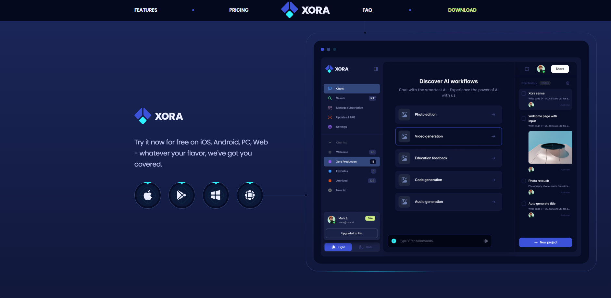
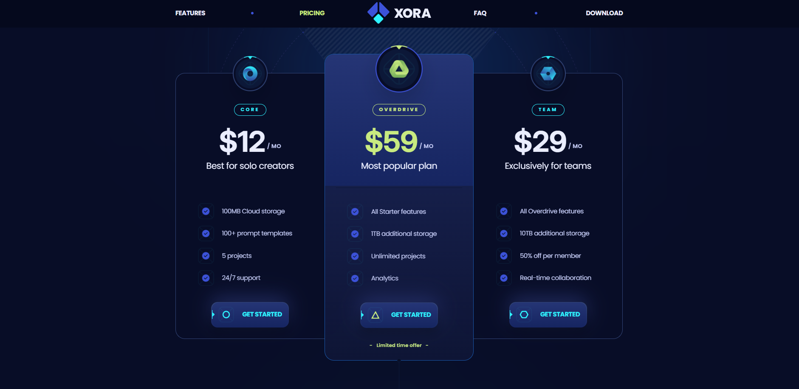

# Xora Project


## Overview

Xora is a modern web application built with ReactJS. It aims to provide users with an intuitive and seamless experience. The project leverages the latest web technologies to ensure high performance and scalability.

## Technologies Used

- **ReactJS**: A JavaScript library for building user interfaces.
- **React Router**: Declarative routing for React.
- **Tailwind CSS**: A utility-first CSS framework for rapid UI development.
- **Styled Components**: Visual primitives for the component age.
- **ESLint**: A tool for identifying and fixing problems in JavaScript code.
- **Babel**: A JavaScript compiler.

## Project Structure

```
/WebReact/xora
├── public
│   ├── image_git
│   │   ├── logo.png
│   │   └── screenshot.png
│   └── index.html
├── src
│   ├── components
│   ├── containers
│   ├── redux
│   ├── App.js
│   └── index.js
├── package.json
└── README.md
```

## Features

- **User Authentication**: Secure login and registration.
- **Responsive Design**: Optimized for various devices.
- **Dynamic Content**: Real-time updates and interactions.
- **State Management**: Efficient state handling with Redux.

## Screenshot

## Screenshot

### Xora Home


### Xora Download


### Xora Price


## Installation

To clone and run this application, you'll need [Git](https://git-scm.com) and [Node.js](https://nodejs.org/en/download/) (which comes with [npm](http://npmjs.com)) installed on your computer. From your command line:

```bash
# Clone this repository
$ git clone https://github.com/your-username/xora.git

# Go into the repository
$ cd xora

# Install dependencies
$ npm install

# Run the app
$ npm start
```

## Contributing

We welcome contributions! Please read our [Contributing Guidelines](CONTRIBUTING.md) for more information.

## License

This project is licensed under the MIT License - see the [LICENSE](LICENSE) file for details.

## Contact

For any inquiries, please contact us at [support@xora.com](mailto:support@xora.com).
